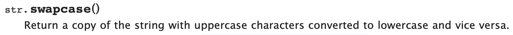

# Built-in Methods

## Example: Swapcase

Python comes with a lot of functionality already built out. This means that there are some commonly used operations that are a lot easier to do than you might think. Here's an example:

There's a method called swapcase that looks like this:

```python
print("Manuel".swapcase())
#=> This will print out the string "mANUEL"
```

You may already be able to figure it out, but try calling .swapcase() on the strings "hello", "HELLO", and "heLLo" to see if your predictions match up.

## Variables or Literals?

Before we get too much farther in, it's important to be clear on some vocabulary that will come up often. Let's learn the difference between a variable and a literal.

```python
"Ivy" #This is a literal. It simply provides information - in this case, that information is a string.

name = "Ivy" #This is the initialization of a variable called name.
# It means that the variable called name contains the string "Ivy"
```

Since a literal and a variable in the example above contain the exact same information, the following two lines of code will actually work the exact same way.

```python
print("Ivy".swapcase())
#=> This will print the string "iVY" to the console.
print(name.swapcase())
#=> This will print the string "iVY" to the console, since we stored the string "Ivy" in the variable called name.
```

Both literals and variables are useful, but as you write more and more complex code, you'll find that variables, as their name suggests, will be much more flexible and responsive. For example, when Facebook built their platform, you hadn't signed up yet, so they couldn't know your name - they'd HAVE to use a variable and then initialize it later once YOU type in the string that represents your name.

## Variables: Initializing, Accessing, and Reassigning

You'll need three more vocab words to feel really comfortable with these. Here's the quickest and easiest version of them.

#### Initializing

This is when you create a variable for the first time and assign it a value.

```python
age = 17 # This initializes a variable called age and gives it an integer value of 17.
```

#### Accessing

This is when you do something with a variable but don't want to save those changes.

```python
print(age * 2)
# This line of code will print out double your age - it accesses your age, which is 17, and doubles it with the * 2 operator.
# BUT your age is still saved as 17
```

#### Reassigning

This is when you change the value of a variable and DO want to save those changes. In our age example, someone's age changes every year on their birthday, so we will need to reassign the age to a higher value.

```python
age = 18 # This is LITERAL reassignment. It simply provides a new integer.

# There's another way to do it:
age = age + 1
```

This second method of assignment is slightly more complicated, but basically the left side of the equals sign says which variable we are changing, and the right side says what we are changing it to.

One way to read this is `(our new value for) age = (our current value for age) + 1`.

The literal assignment would only be accurate for someone who is turning 18. The more flexible second assignment would work for ANY age; it just adds 1 to the current value, WHATEVER that value is.

## The Lab!

This lab has one python file in it, and most of the lines are commented out with descriptions of what you should try to do.

Since the python file is called `speak.py`, you can run it by entering the command `python speak.py` in the console (command line). Try this after each line of code you write to see if you're successfully completing each of the challenges.

###### Note: If your working directory isn't this lab, that python command will not work. Try typing `ls` and see if you can figure out how you can `cd _____` to get to this lab.

## Documentation: More than Swapcase()!

We've already shown you a really wonderful (but weird) built-in method called swapcase, but that's just one of dozens. To see more, you'll want to look at what's called "Documentation". The word "Documentation" refers to the user's guide to a programming language or library.

Python has EXCELLENT documentation. You can get there pretty simply by searching for "Python String Methods" (or whatever topic you'd like to see explained). Results in the "docs.python.org" domain are official but there are lots of other great resources online so look around.

Take a look at this screen grab from Python's documentation:



It clearly explains what the method does and how to use it on a string.

## Finding other methods

Some of the methods have a very natural human feel to them (like the `.upper()` method, for example) and you may be able to understand what they do immediately. Others (like `.maketrans()`) may seem a lot stranger, and will only make sense once you've seen some more complex code.

To navigate documentation efficiently, many developers use `cmd + f` or `ctrl + f` to pull up the "find" text field. They then use related keywords to jump straight to the information they need. If you want to figure out how to make a string print out backwards, try typing words like "backwards" or "reverse" in the find field.

## If you get stuck...

Here are a few of the answers to select challenges.

#### Challenge 1

<details>
  <summary>Click to see solution</summary>

  In the speak.py file:

  ```python
  print(name.swapcase())
  ```

  In the console / command line:

  ```bash
  python speak.py
  ```

</details>
<br>


#### Challenge 5

<details>
  <summary>Click to see solution</summary>

  ```python
  print(count("i"))
  ```

</details>
<br>


#### Challenge 8

<details>
  <summary>Click to see solution</summary>

  ```python
  print(name.upper()[::-1])
  ```

</details>
